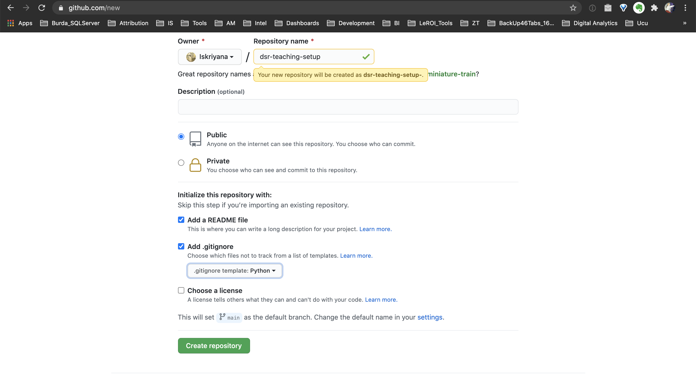

# DSR Teaching: How to SetUp a Data Science Project

## Project Description
The purpose of this mini-project is to show how to set up a data science project

It follows these steps: 
1. Create a new repository in GitHub
2. Clone the repository on your computer
3. Set your Readme, .gitignore & requirements file
    ❗️Push your changes❗️
4. Create a Conda environment
5. Install needed packages
6. Make the environment visible in Jupyter Notebook / Jupyter Lab
7. Install a Code Formatter
8. Start Jupyter Lab / Jupyter Notebook
            
 
### Tech Stack 
* Python
* Jupyter Lab & Jupyter Notebook
* Visual Studio Code ([download here](https://code.visualstudio.com/download)) or  PyCharm ([installation instructions](https://www.jetbrains.com/help/pycharm/installation-guide.html))
* Github
    * Example for file structure - pipeline and project workflow template of  [DSSG](https://github.com/dssg/hitchhikers-guide/tree/master/sources/curriculum/0_before_you_start/pipelines-and-project-workflow). 
    * [repo template](https://github.com/Iskriyana/data-science-project-template)  

## Detailed Instructions 

### 1. Create a Repo in GutHub

* You can create a repo in GutHub by following these [instructions](https://docs.github.com/en/free-pro-team@latest/github/getting-started-with-github/create-a-repo
)
* Initialise the repository with both a readme and a .gitignore file
    * the README is what you are reading now 😉. It contains useful information about the project and how to set it up
    * the .gitignore file contains all files and folders that should NOT be pushed to the repository, i.e. they should remain hidden. Examples are: files containing passwords, folders containing raw data. Select the template for Python.  

### 2. Clone the New Repository
In your terminal:
* Go to the folder, in which you keep your repositories. Use `cd <YOUR FOLDER NAME>`
* Execute `git clone https://github.com/<YOUR USERNAME>/dsr-setup.git`
    * In general `git clone https://github.com/<YOUR USERNAME>/<YOUR REPO NAME>.git`
* If you need any help, see this [tutorial](https://help.github.com/articles/cloning-a-repository/).

### 3. Set your README, .gitignore & requirements file
* README
    * Idea for [structure](https://github.com/Iskriyana/data-science-project-template)
    * Help for the [formatting](https://docs.github.com/en/free-pro-team@latest/github/writing-on-github/basic-writing-and-formatting-syntax)
    * PyCharm comes in handy when creating the file
* .gitignore
    * [documentation](https://git-scm.com/docs/gitignore)
    * Collection of [.gitignore templates](https://github.com/github/gitignore). Relevant for you is the Python one
* requirements.txt
    * Create a simple empty `.txt` file
    * Every time you install a new package, add it with its version to this file in the format `package==version
    * There are also automatic ways to create this file. However, they are some times either too detailed or do not include everything
        * create with pip: `pip freeze > requirements.txt`
        * create with [PyCharm](https://www.jetbrains.com/help/pycharm/managing-dependencies.html#configure-requirements)
    * For the exercise add the following:\
    `numpy==1.26.3` \
    `pandas==2.1.4` \
    `seaborn==0.13.1` \
    `scikit-learn==1.3.2`

* After setting the files, push to repository by typing in your terminal
    * `git add .`
    * `git commit -m '240108_repo_setup'`
    * `git push origin main`
    
### 4. Create a Conda Environment
In your terminal: 
* `conda create -n dsr-setup python=3.12`
* `conda activate dsr-setup`
* conda [cheat sheet](https://docs.conda.io/projects/conda/en/4.6.0/_downloads/52a95608c49671267e40c689e0bc00ca/conda-cheatsheet.pdf)

### 5. Install needed packages
Still in your terminal and in the root folder of your repository execute
* `pip install -r requirements.txt`

### 6. Make The Environment Visible in Jupyter Lab / Jupyter Notebook
In your terminal make sure the environment is activated and execute:
* `pip install ipykernel`
* `python -m ipykernel install --user --name dsr-setup --display-name "dsr-setup"`
    * in general `python -m ipykernel install --user --name <YOUR ENVIRONMENT> --display-name "<YOUR ENVIRONMENT DISPLAY NAME>"`

### 7. Start Jupyter Lab / Jupyter Notebook
* Make sure the environment is activated
* Just type `jupyter lab` or `jupyter notebook`
* **NOTE**: the folder, from which you started jupyter, will be your root folder.
* **NOTE**: if your tool of choice does not start, try first installing it by running `conda install jupyter`or `conda install jupyterlab`

### Bonus: Install a Code Formatter
* It is best practice to format your Python code according to [PEP 8](https://www.python.org/dev/peps/pep-0008/)
* Especially while learning, try to pay attention to it and correct yourself manually
* You can then automatically format your code by installing a code formatter
* Make sure your environment is activated
* `pip install jupyterlab_code_formatter`
* `jupyter server extension enable --py jupyterlab_code_formatter`
* `pip install autopep8`
* [documentation](https://jupyterlab-code-formatter.readthedocs.io/installation.html)
* Deactivate & activate the environment in order for the changes to take place:
    * `conda deactivate`
    * `conda activate dsr-setup` 

---

